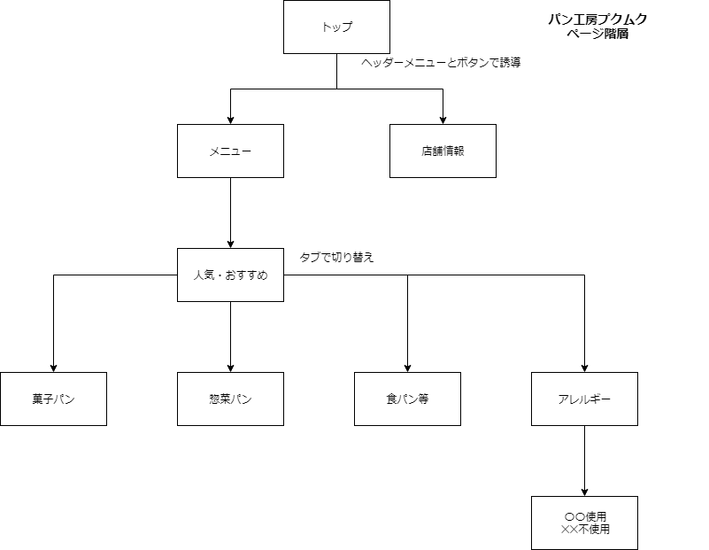
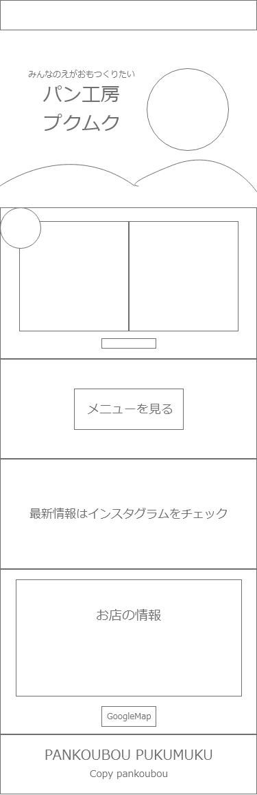
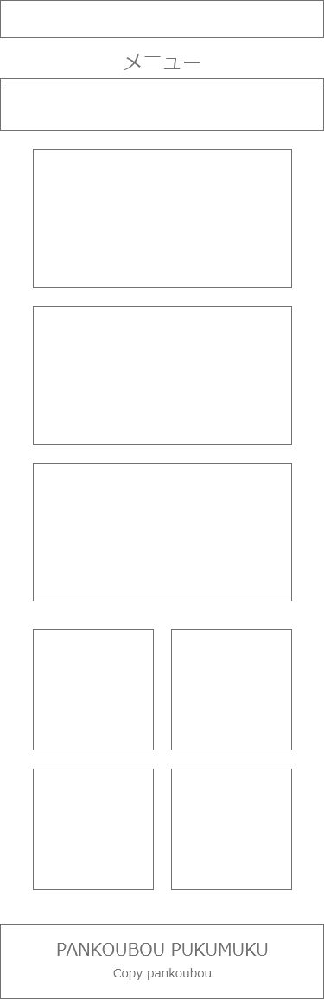
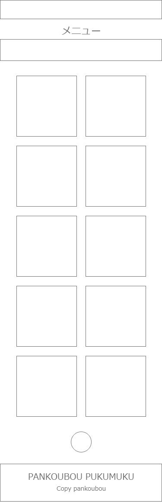
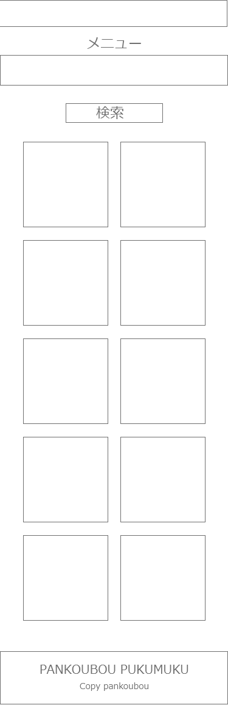
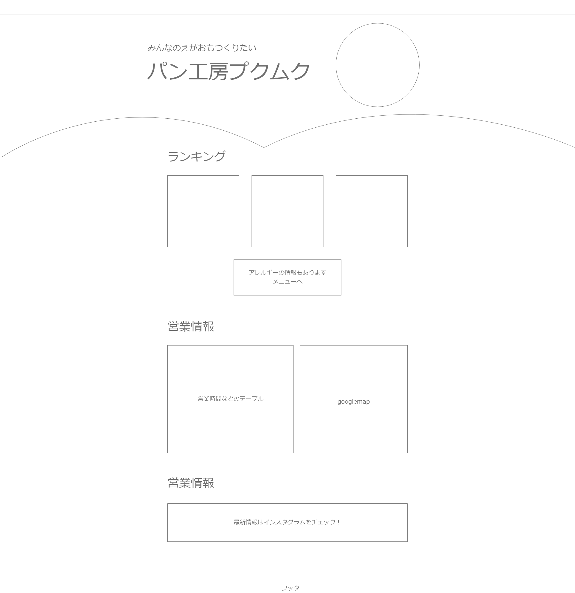

# 「パン工房プクムク」のHP企画書 2019/3/20

## Webサイトの目的

> プクムクのお客さんは基本地元の人たちで、出勤前によってくれる人や、差し入れとして買ってくれる人など、年齢も職種も偏りがない。
> 
> 一方で、ちょっと中野区行くけどいいとこないかな？という流れで、検索して来てくれるお客さんはあまりいないのではないか。
> 
> 私は、小さい頃からプクムクのパンを食べて育った。今、アルバイトさせてもらっていても本当に好きなパン屋さんで、出来れば多くの人に知ってもらいたいと思う。
> 
> なので、インターネットの検索からお店を見つけてくれるお客さんを増やすためにもWebサイトを作りたい。
> 
> 食べログの二次的な情報（写真やメニュー）を見て来てくれることはあるかもしれないが、一次情報があればより信頼性と興味を持ってくれるだろう。
> 
> 食べログなどのレビューサイトとの差別化はアレルギー情報を強調することにする。
> 
> SEO対策はまだ考えていないが、中野区のパン屋やアレルギーに関する検索で人の目にとまるようにしたい。
> 
> プクムクズのCDを誰でも聞けるようにしてほしいということで、サイト内で再生させたい。

## リソース

- プクムクズの音楽
- メニュー：ランキング、オススメ、アレルギー、こだわり
- お知らせ：新商品とイベント出店など
- 店舗情報：地図、電話番号、営業時間、休業日、予約、トロワさんとか関連のあるお店
- 最新情報：インスタグラム

## サイトの雰囲気

赤と黄色がメインの明るいサイトにしたい。
マックのサイト程混雑していないが、雰囲気はこんな感じのイメージ。

- マクドナルド
 [マクドナルド公式サイト \| McDonald's Japan](http://www.mcdonalds.co.jp/)

## サイトマップ

それぞれのページは下の要素で構成する。

### ナビゲーション

パソコンではヘッダーメニュー、モバイルではハンバーガーアイコンを使う。
インスタのアイコンと同じ画像をヘッダーに貼っておき、トップページへの誘導をする。

### トップページ

- サイトのタイトルと画像：「パン工房プクムク」
- ランキングトップ3のパン
- メニュー一覧への誘導
- 店舗情報
- GoogleMapへ誘導
- 最新情報のinstagramへの誘導
- プクムクについて

### メニューページ

#### メニュートップはおすすめの商品

- ランキングトップ3
- こだわりの酵母パンと麹パン、ワンちゃんパンなど...

#### メニューのパン種類別タブ

- 惣菜パン
- 菓子パン
- 食パン・フランスパン
- アレルギーにタブ

### 店舗情報ページ

- 営業時間
- 休業日
- 住所
- 予約の電話番号
- GoogleMap

## ワイヤーフレーム

### モバイル画面

- mobile1

  

- mobile2

  

- mobile3

  

- mobile4

  

### パソコン画面について

- desctop1

  

## デザイン

- キーカラーは赤色 、その他の色は緑、紫、黄色を使う。
- バックグランドはパンの色
- タイトルは4色使う

## ロードマップ

1. 目的と何を提供するか決める
2. ワイヤーフレームを完成される
3. 細かいデザインを完成させる
4. 素材を揃える
5. 必要なコンポーネントを洗い出す
6. Vue.jsでどのようなディレクトリ構造、コンポーネント構造にするか決める
7. それぞれの機能に使用するプラグイン等を決定する
8. コードを書く
9. ドメインを取得する
10. アップする

## コンポーネント

プクムクのホームページ  
├ トップページページ  
├

### 共通のコンポーネント

- タイトル（手書きで4色）
- パンのカード
- ランキングのラベル
- アレルギーのセレクトボタン
- もっと知るボタン
- インスタのアイコン
- ヘッダーナビゲーション

### 「メニュー」のコンポーネント

### 「営業情報」のコンポーネント

### 「プクムクについて」のコンポーネント
